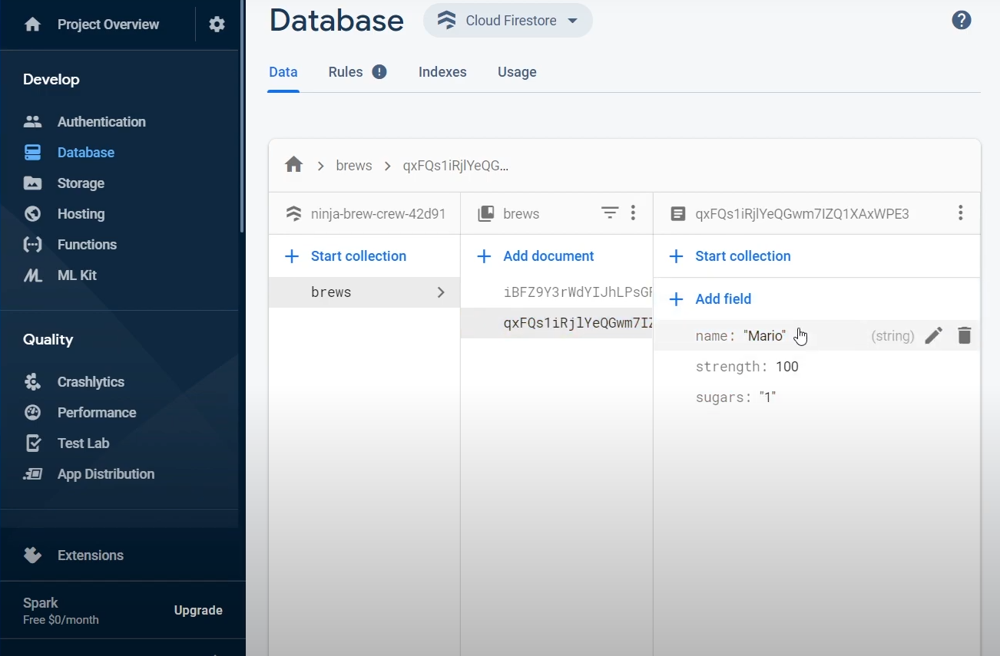

# Brew Crew

Brew Crew is a Flutter-based coffee ordering application that allows users to browse a variety of coffee options, place orders, and manage their preferences. Whether you’re a coffee aficionado or just looking for a quick caffeine fix, Brew Crew offers a seamless and intuitive experience to satisfy your coffee cravings.

## Pages:

## Key Features

- **Coffee Menu**: Browse through a diverse menu of coffee options, including different types of coffee beans, brewing methods, and flavorings. Each item includes details such as name, description, and price.
- **Order Placement**: Easily place orders by selecting items from the menu, specifying quantities, and customizing options (e.g., size, milk type, sugar level).
- **User Authentication**: Create and manage user accounts, with the ability to save favorite coffee orders, view order history, and manage payment details.
- **Cart Management**: Add items to your cart, review your selections, and make modifications before finalizing your order.
- **Real-Time Updates**: Get real-time notifications about your order status, including preparation and delivery updates.
- **Customizable UI**: Enjoy a visually appealing and responsive design, optimized for both mobile and tablet devices.
- **Dark Mode Support**: Switch between light and dark modes to suit your preference and enhance readability.

## Technologies Used

- **Flutter**: The primary framework used to build the application, enabling cross-platform development for both Android and iOS.
- **Dart**: The programming language utilized for Flutter development.
- **Firebase**: Used for user authentication, real-time database management, and cloud storage for images and user data.
- **REST APIs**: To handle data fetching and interaction with backend services for order processing and payment.
- **State Management**: Leveraging libraries such as Provider or Riverpod for efficient state management throughout the app.

## Advantages of Using Flutter

- **Cross-Platform Development**: Write once, run anywhere – develop for both Android and iOS with a single codebase.
- **Hot Reload**: See changes in real-time, which speeds up development and debugging processes.
- **Customizable Widgets**: Create a highly interactive and engaging user interface with Flutter’s rich set of widgets.
- **High Performance**: Native compilation ensures smooth performance and responsiveness.

## Use Cases

- **Coffee Shops**: Implement the app to streamline the ordering process and enhance customer experience.
- **Coffee Enthusiasts**: Provides a convenient way for users to explore new coffee options and manage their orders.
- **Event Catering**: Use the app for managing coffee orders at events or large gatherings.
